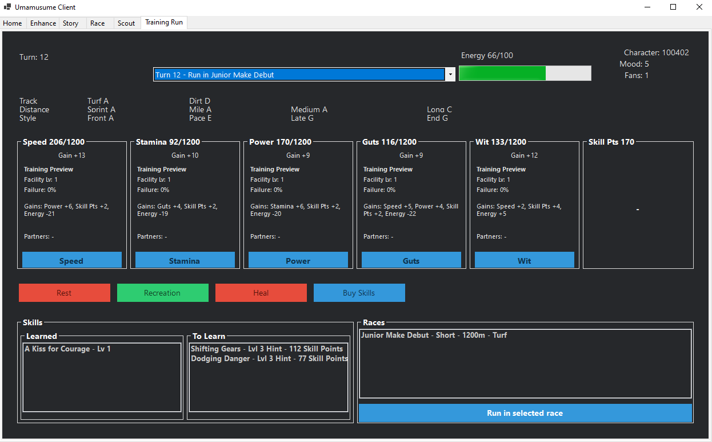

# Acknowledgements
A fork of https://github.com/cc004/UmamusumeClient by cc004 whose work for previous servers greatly helped me and made this adaptation for global possible. 

## Disclaimer
This project is completely against the TOS of the game. Do not use your account with this tool, as you WILL get banned. The author and contributors cannot be held accountable for any consequences that may arise from using this tool.

## License
This project is licensed under the [GNU Affero General Public License v3.0](./LICENSE).

# Global Honse
A custom client for the global version of the funny horse girls game, with the ability to automate training runs.
*Coming Soon*

